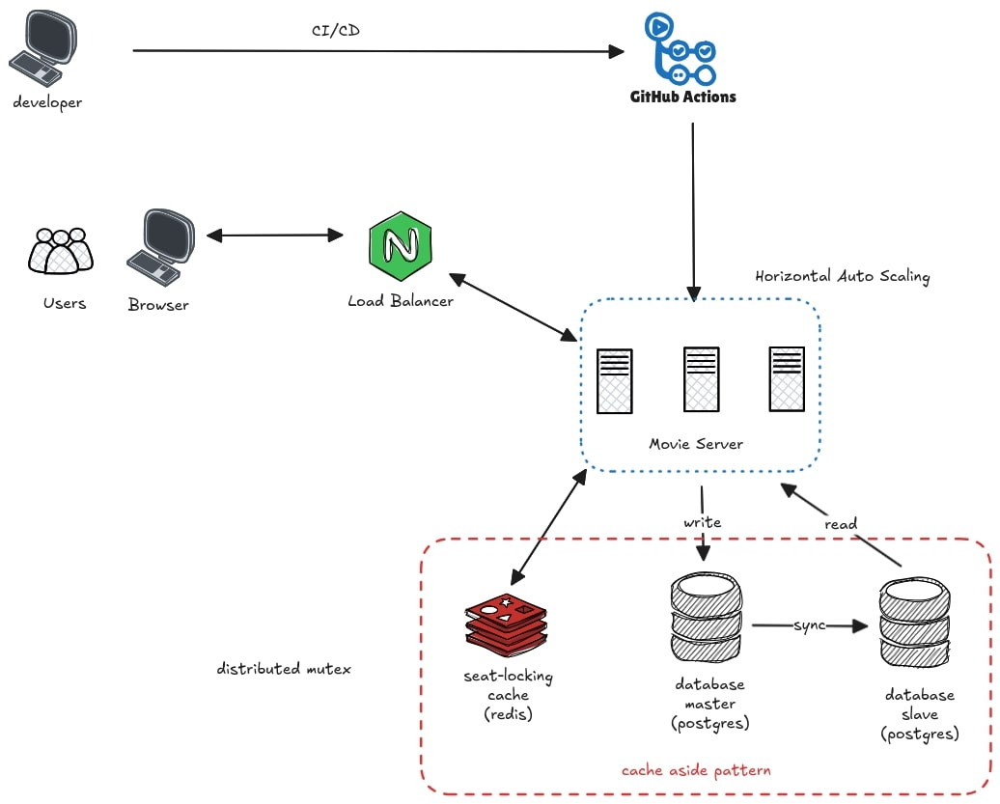
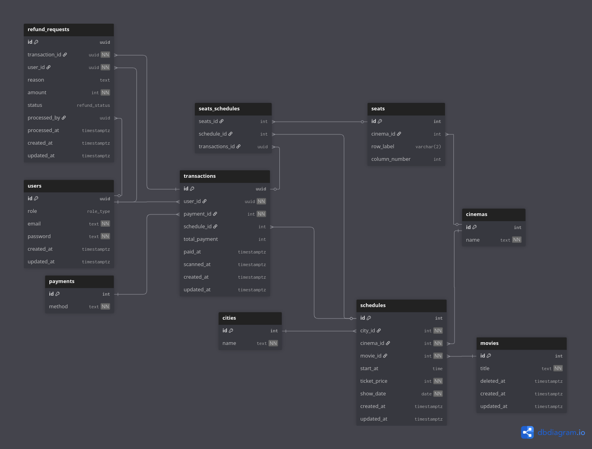

# 🎬 Platform Tiket Bioskop

**Author:** Radifan Muhammad Aghnadiin 

## 1. System Design 

### ✅ Functional Requirements
- Admin dapat melakukan **CRUD** untuk data film.  
- Admin dapat melakukan **manajemen jadwal tayang (showtime)**.  
- Customer dapat melihat **tempat duduk mana yang sudah dibeli**.  
- Customer dapat **memesan tiket bioskop** (kursi belum fix diambil).  
- Customer dapat **membeli lebih dari satu kursi**.  
- Customer dapat **melakukan pembayaran** untuk mengambil kursi.  
- Customer dapat **melakukan refund** jika tiket bioskop dibatalkan.  
- **Setiap cabang bioskop** dapat memiliki jumlah baris dan kolom kursi yang berbeda.

### ⚙️ Non-Functional Requirements
- Sistem harus mampu menangani **isu concurrency**  
  (contoh: beberapa customer mencoba membeli kursi pada showtime yang sama).  
- Sistem harus dapat **melayani customer secara nasional**,  
  mencakup berbagai cabang bioskop di banyak kota.  

---
## 2. Database Design

Struktur tabel lengkap dapat dilihat di file berikut:

📄 [db/script-postgres.sql](./db/script-postgres.sql)

---

---
## 3. Skill Test

Postman collection dapat dilihat di file berikut:

📄 [postman/bioskop.json](./postman/bioskop.json)

---

